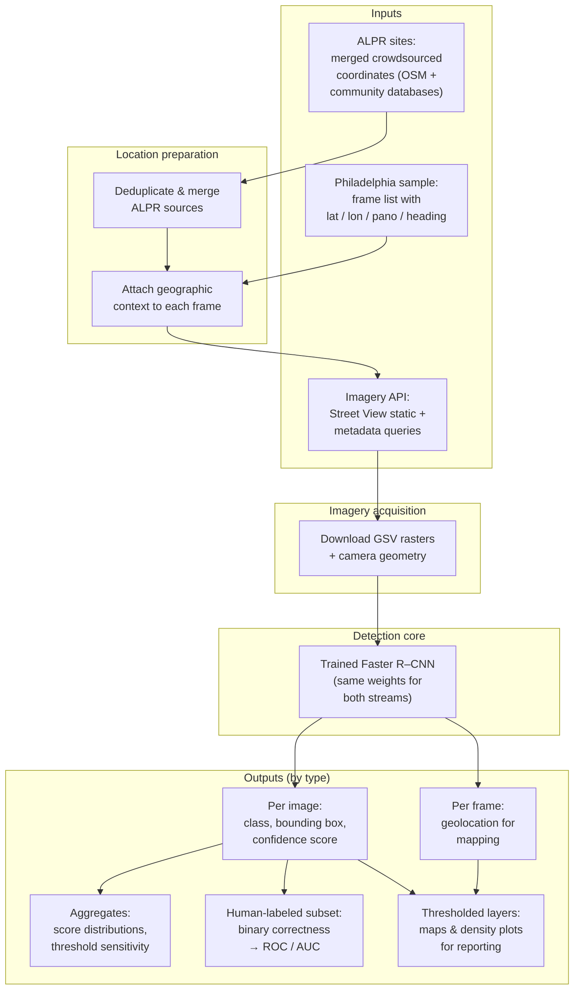
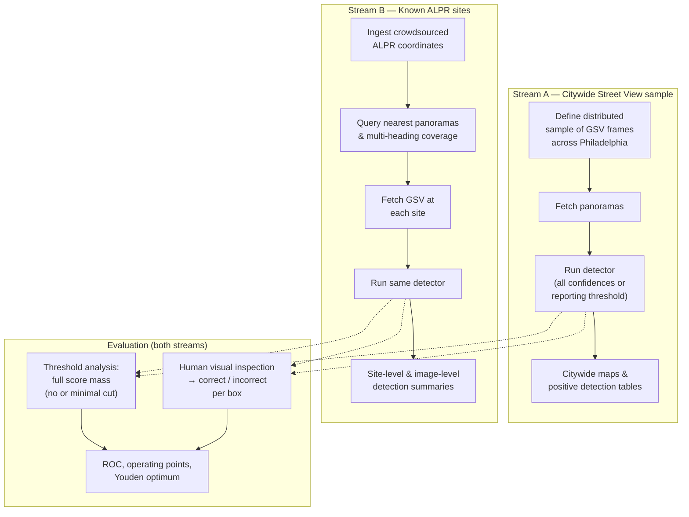
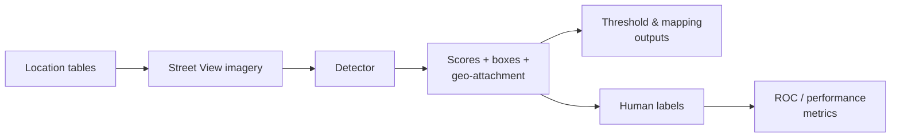

# Thesis figures: system architecture & workflow

Render with [Mermaid](https://mermaid.js.org/) (e.g. [mermaid.live](https://mermaid.live)). Export **SVG** or **PDF** for print.

**Suggested captions**

- *Figure X — System view: inputs, processing stages, and classes of outputs for Street View camera detection.*
- *Figure Y — Workflow: two location streams converging on imagery, detection, and evaluation.*

---

## 1. System diagram (pipeline I/O, not file layout)

*Shows **what kind of thing** enters and leaves each stage—not filenames or one-off experiments.*

---

## 2. Workflow diagram (end-to-end process)

*Two parallel location streams; shared detector; evaluation branches.*

---

## 3. Minimal strip (optional small figure)

---

### Notes for the thesis (conceptual)

- **Threshold analysis** records the **full** confidence distribution (with **NMS**); a **stricter cutoff** is applied separately for maps and tables.  
- **ROC** uses **human** binary labels on inspected boxes, not the full automated run.  
- **Both streams** share one **model**; they differ in **where** you point the camera (general sample vs. ALPR-listed sites).
