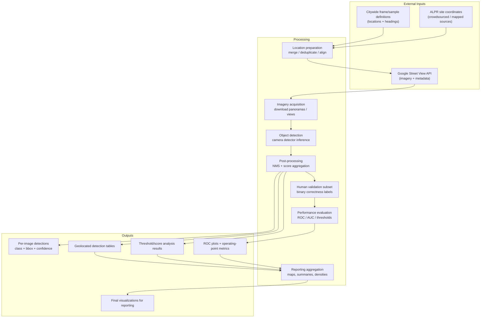

## System Pipeline Diagram

```mermaid
flowchart TB
  subgraph IN["External Inputs"]
    I1["Citywide frame/sample definitions<br/>(locations + headings)"]
    I2["ALPR site coordinates<br/>(crowdsourced / mapped sources)"]
    I3["Google Street View API<br/>(imagery + metadata)"]
  end

  subgraph PROC["Processing"]
    P1["Location preparation<br/>merge / deduplicate / align"]
    P2["Imagery acquisition<br/>download panoramas / views"]
    P3["Object detection<br/>camera detector inference"]
    P4["Post-processing<br/>NMS + score aggregation"]
    P5["Human validation subset<br/>binary correctness labels"]
    P6["Performance evaluation<br/>ROC / AUC / thresholds"]
    P7["Reporting aggregation<br/>maps, summaries, densities"]
  end

  subgraph OUT["Outputs"]
    O1["Per-image detections<br/>class + bbox + confidence"]
    O2["Geolocated detection tables"]
    O3["Threshold/score analysis results"]
    O4["ROC plots + operating-point metrics"]
    O5["Final visualizations for reporting"]
  end

  I1 --> P1
  I2 --> P1
  P1 --> I3
  I3 --> P2
  P2 --> P3
  P3 --> P4
  P4 --> O1
  P4 --> O2
  P4 --> O3
  P4 --> P5
  P5 --> P6
  P6 --> O4
  O2 --> P7
  O3 --> P7
  O4 --> P7
  P7 --> O5
```
